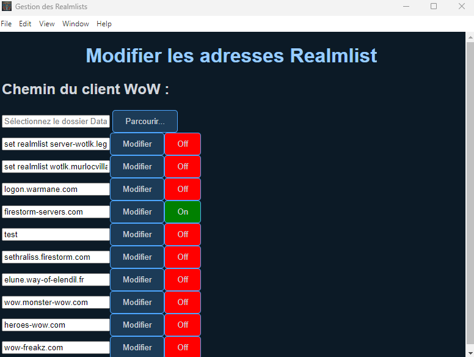

# WoW Realmlist Manager

Un outil simple et efficace pour gérer votre fichier realmlist.wtf de World of Warcraft 3.3.5a. Cette application vous permet de basculer facilement entre différents serveurs en un seul clic.

## Fonctionnalités

- Basculement facile entre plusieurs serveurs
- Lancement de WoW en un clic
- Interface moderne et intuitive
- Support multilingue (FR/EN/ES)
- Sauvegarde automatique du fichier realmlist.wtf
- Support Windows et Linux (via Wine)
- Version portable disponible

## Capture d'écran



## Installation

### Windows
Vous pouvez au choix :
- Télécharger et exécuter l'installateur (`WoW Realmlist Manager Setup 2.0.0.exe`)
- Utiliser la version portable (`WoW Realmlist Manager 2.0.0.exe`)

### Linux
1. Installez Wine si ce n'est pas déjà fait :
   ```bash
   sudo apt update
   sudo apt install wine wine32:i386 wine64
   ```

2. Installez le paquet .deb :
   ```bash
   sudo dpkg -i wow-realmlist-manager_2.0.0_amd64.deb
   ```

## Utilisation

1. Définissez le chemin de votre répertoire WoW
2. Ajoutez vos serveurs favoris
3. Cliquez sur le bouton "On/Off" pour basculer entre les royaumes
4. Utilisez le bouton "Launch WoW" pour démarrer le jeu

## Développement

Construit avec :
- Electron
- Node.js
- HTML/CSS/JavaScript

## Licence

Licence MIT - voir le fichier LICENSE pour plus de détails

## Auteur

Projet réalisé par BlaMacfly
