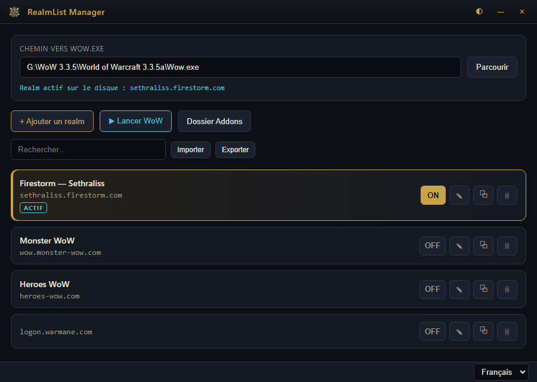

<p align="center">
  
</p>

<h1 align="center">WoW RealmList Manager</h1>

<p align="center">
  Un outil simple et moderne pour gérer votre fichier <code>realmlist.wtf</code> de World of Warcraft
  (versions 1.12 à 3.3.5a) et basculer entre vos serveurs privés en un clic.
</p>

---

## ✨ Fonctionnalités

- 🔀 **Basculement en un clic** entre plusieurs serveurs (nombre illimité)
- 🏷️ **Noms personnalisés** pour chaque realm en plus de l'adresse
- ▶️ **Lancement de WoW** directement depuis l'application (Windows et Linux via Wine)
- 💾 **Sauvegarde automatique** de votre `realmlist.wtf` (`.bak`) avant chaque modification
- 🌍 **Écriture multi-langues** : le fichier est mis à jour dans tous les dossiers de langue présents (`frFR`, `enUS`, `deDE`, …)
- 🔎 **Recherche** instantanée dans votre liste de realms
- 📤 **Import / Export** de votre liste de serveurs au format JSON
- ✏️ **Édition** et réorganisation des realms
- 📋 **Copie** rapide de l'adresse d'un realm
- 🌐 **Interface multilingue** : Français, English, Deutsch, Español
- 🌓 **Thème clair / sombre**
- 📁 Accès direct au **dossier Addons**
- 🔊 Retours sonores

## 🖼️ Capture d'écran



## 📦 Installation

### Windows
Téléchargez `WoW Realmlist Manager 3.0.0.exe` depuis la page des _releases_ et lancez-le (application portable, aucune installation requise).

### Linux
1. Installez Wine :
   ```bash
   sudo apt update
   sudo apt install wine wine32:i386 wine64
   ```
2. Installez le paquet `.deb` :
   ```bash
   sudo dpkg -i wow-realmlist-manager_3.0.0_amd64.deb
   ```

## 🚀 Utilisation

1. Cliquez sur **Parcourir** et sélectionnez votre `WoW.exe`.
2. Ajoutez vos serveurs favoris avec **+ Ajouter un realm** (un nom + l'adresse ; le préfixe `set realmlist` est ajouté automatiquement).
3. Cliquez sur **ON / OFF** pour activer un royaume — le `realmlist.wtf` est mis à jour instantanément.
4. Cliquez sur **▶ Lancer WoW** pour démarrer le jeu.

## 🛠️ Développement

Construit avec **Electron**, **Node.js** et **HTML/CSS/JavaScript**.

```bash
npm install      # installe les dépendances
npm start        # lance l'application en développement
npm run build    # build Windows (portable)
npm run build:linux   # build Linux (.deb)
```

### Architecture

L'application suit le modèle de sécurité recommandé par Electron :

| Fichier | Rôle |
|---|---|
| `main.js` | Processus principal — accès disque, gestion des realms, lancement du jeu |
| `preload.js` | Pont sécurisé (`contextBridge`) exposant une API minimale au renderer |
| `index.html` / `assets/script.js` | Interface (renderer) — **sans** accès direct à Node |
| `assets/style.css` | Thèmes clair/sombre |

`contextIsolation` est activé et `nodeIntegration` désactivé : le renderer ne peut pas accéder directement au système de fichiers.

## 📄 Licence

Licence MIT — voir le fichier [LICENSE](LICENSE).

## 👤 Auteur

Projet réalisé par **BlaMacfly**.
