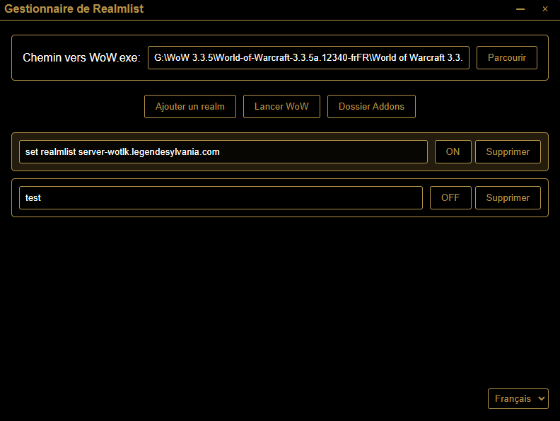

# WoW Realmlist Manager

Un outil simple et efficace pour gérer votre fichier realmlist.wtf de World of Warcraft 3.3.5a. Cette application vous permet de basculer facilement entre différents serveurs en un seul clic.

## Fonctionnalités

- Basculement facile entre plusieurs serveurs
- Lancement de WoW en un clic
- Interface moderne et intuitive
- Support multilingue (FR/EN/ES)
- Sauvegarde automatique du fichier realmlist.wtf
- Version portable disponible

## Capture d'écran

## Installation

Vous pouvez au choix :
- Télécharger et exécuter l'installateur (`WoW Realmlist Manager Setup 1.0.0.exe`)
- Utiliser la version portable (`WoW Realmlist Manager 1.0.0.exe`)

## Utilisation

1. Définissez le chemin de votre répertoire WoW
2. Ajoutez vos serveurs favoris
3. Cliquez sur le bouton "On/Off" pour basculer entre les royaumes
4. Utilisez le bouton "Launch WoW" pour démarrer le jeu

## Développement

Construit avec :
- Electron
- Node.js
- HTML/CSS/JavaScript

## Licence

Licence MIT - voir le fichier LICENSE pour plus de détails
